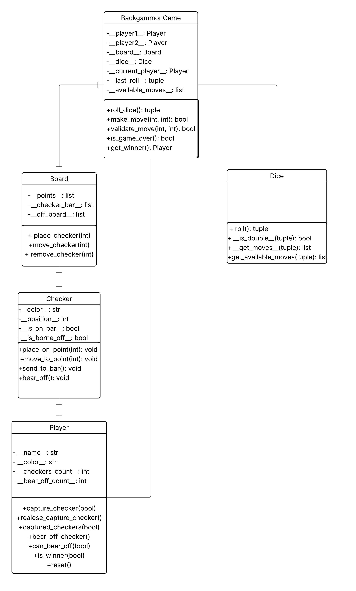

# Justificación del Diseño - Backgammon Game

## Resumen del diseño general

El proyecto implementa un juego de Backgammon completo en Python siguiendo principios de arquitectura limpia y separación de responsabilidades. La arquitectura se divide en tres capas principales:

1. **Capa Core (`core/`)**: Contiene toda la lógica de negocio del juego, independiente de cualquier interfaz de usuario
2. **Capa CLI (`cli/`)**: Implementa la interfaz de línea de comandos
3. **Capa Pygame UI (`pygame_ui/`)**: Implementa la interfaz gráfica usando Pygame

Esta separación garantiza que la lógica del juego sea reutilizable y testeable independientemente de la interfaz, cumpliendo con el principio de inversión de dependencias.

### Cumplimiento de Requisitos del Juego

**Tablero de juego**: Implementado con 24 puntos triangulares divididos en cuatro cuadrantes, con posiciones iniciales estándar para 15 fichas por jugador.

**Fichas y dados**: Sistema completo de 15 fichas por jugador con dos dados de seis caras, incluyendo lógica para tiradas dobles que permiten 4 movimientos del mismo valor.

**Jugabilidad**: Implementación completa de reglas tradicionales incluyendo movimientos válidos, capturas, reingresos desde la barra y condición de victoria.

**Interfaces duales**:

- CLI
- Pygame

## Justificación de las clases elegidas (por qué, responsabilidades)

### Core Classes

**BackgammonGame**: Clase principal que coordina todo el flujo del juego

- **Responsabilidad**: Orquestar el juego, manejar turnos, validar movimientos
- **Justificación**: Centraliza la lógica de negocio y mantiene el estado del juego

**Board**: Representa el tablero y sus puntos

- **Responsabilidad**: Gestionar posiciones de fichas, validar movimientos, manejar capturas
- **Justificación**: Encapsula toda la lógica relacionada con el tablero físico

**Player**: Representa a un jugador

- **Responsabilidad**: Mantener información del jugador (nombre, color, fichas)
- **Justificación**: Permite extensibilidad para diferentes tipos de jugadores

**Checker**: Representa una ficha individual

- **Responsabilidad**: Mantener estado de posición y color de cada ficha
- **Justificación**: Permite rastreo individual de fichas y futuras extensiones

**Dice**: Maneja la lógica de dados

- **Responsabilidad**: Generar tiradas aleatorias y calcular movimientos disponibles
- **Justificación**: Encapsula la lógica de dados para reutilización

### CLI Classes

**BackgammonCLI**: Coordinador principal

- **Responsabilidad**: Coordinar componentes y manejar flujo principal
- **Justificación**: Sigue el patrón Facade, simplifica la interacción con el sistema

**BoardRenderer**: Renderizado del tablero

- **Responsabilidad**: Formatear y mostrar el tablero en consola
- **Justificación**: Separación clara de responsabilidades (SRP)

**CommandParser**: Parsing de comandos

- **Responsabilidad**: Interpretar comandos del usuario y enrutar a handlers
- **Justificación**: Facilita extensión de nuevos comandos (OCP)

**InputValidator**: Validación de entrada

- **Responsabilidad**: Validar datos de entrada del usuario
- **Justificación**: Centraliza validaciones y facilita testing

**GameController**: Control del juego

- **Responsabilidad**: Intermediario entre CLI y lógica de negocio
- **Justificación**: Abstrae la complejidad del core para la interfaz

**UserInterface**: Interfaz de usuario

- **Responsabilidad**: Manejar entrada/salida del usuario
- **Justificación**: Centraliza operaciones de I/O

### Pygame UI Classes

**BackgammonBoard**: Coordinador principal de la interfaz gráfica

- **Responsabilidad**: Gestionar dimensiones, colores y coordinar componentes de renderizado
- **Justificación**: Sigue el patrón Facade, centraliza la configuración visual

**BoardInteraction**: Manejo de interacciones del usuario

- **Responsabilidad**: Convertir coordenadas de mouse a puntos del tablero y manejar selecciones
- **Justificación**: Separación clara entre lógica de interacción y renderizado (SRP)

**Button**: Componente de interfaz reutilizable

- **Responsabilidad**: Renderizar botones interactivos con estados hover y click
- **Justificación**: Componente reutilizable que facilita extensión de UI (OCP)

**BoardRenderer**: Renderizado del tablero gráfico

- **Responsabilidad**: Dibujar la estructura del tablero, puntos triangulares y áreas especiales
- **Justificación**: Encapsula toda la lógica de renderizado del tablero (SRP)

**CheckerRenderer**: Renderizado de fichas

- **Responsabilidad**: Dibujar fichas individuales en diferentes estados (puntos, barra, bear-off)
- **Justificación**: Separación de responsabilidades para renderizado de elementos específicos (SRP)

**DiceRenderer**: Renderizado de dados

- **Responsabilidad**: Dibujar dados con sus valores y animaciones
- **Justificación**: Componente especializado para renderizado de dados (SRP)

## Justificación de atributos (por qué se eligieron)

### BackgammonGame

- `player1`, `player2`: Referencias a los jugadores del juego
- `board`: Instancia del tablero
- `dice`: Instancia de dados
- `current_player`: Jugador actual (para manejo de turnos)
- `last_roll`: Última tirada de dados
- `available_moves`: Movimientos disponibles basados en la tirada
- `move_history`: Historial de movimientos (para debugging y análisis)

### Board

- `points`: Array de 24 listas representando cada punto del tablero
- `checker_bar`: Array bidimensional para fichas capturadas [blancas, negras]
- `off_board`: Array bidimensional para fichas que salieron del tablero

### Player

- `name`: Identificador del jugador
- `color`: Color de las fichas ('white' o 'black')
- `checker_count`: Contador de fichas (para validaciones)

### Checker

- `color`: Color de la ficha
- `position`: Posición actual en el tablero
- `is_on_bar`: Estado de captura
- `is_born_off`: Estado de salida del tablero

### Pygame UI Classes

**BackgammonBoard**

- `width`, `height`: Dimensiones de la pantalla
- `screen`: Superficie principal de Pygame
- `colors`: Diccionario de colores para el tema visual
- `board_renderer`, `checker_renderer`, `dice_renderer`: Componentes especializados
- `roll_button`: Botón para tirar dados
- `board_interaction`: Manejador de interacciones

**BoardInteraction**

- `selected_point`: Punto seleccionado por el usuario
- `valid_destinations`: Destinos válidos para el movimiento
- `game`: Referencia al juego para lógica
- `board_state`: Estado actual del tablero

**Button**

- `rect`: Rectángulo del botón para detección de colisiones
- `text`: Texto del botón
- `color`, `hover_color`: Colores para estados normal y hover
- `is_hovered`: Estado de hover para feedback visual

**Renderers (BoardRenderer, CheckerRenderer, DiceRenderer)**

- `colors`: Paleta de colores compartida
- `checker_radius`, `dice_size`: Parámetros de renderizado específicos
- Métodos especializados para renderizado de elementos específicos

## Decisiones de diseño relevantes

### 1. Separación Core/UI

**Decisión**: Separar completamente la lógica de negocio de las interfaces
**Justificación**: Permite reutilización, testing independiente y facilita mantenimiento

### 2. Arquitectura SOLID en CLI

**Decisión**: Refactorizar CLI monolítico en componentes especializados
**Justificación**: Mejora mantenibilidad, testabilidad y extensibilidad

### 3. Uso de Checker Objects

**Decisión**: Crear objetos Checker individuales en lugar de solo contadores
**Justificación**: Permite rastreo detallado y futuras extensiones (animaciones, IA)

### 4. Manejo de Estado en BackgammonGame

**Decisión**: Centralizar estado del juego en una sola clase
**Justificación**: Simplifica coordinación y mantiene consistencia

### 5. Estructura de Board

**Decisión**: Usar arrays de listas para puntos del tablero
**Justificación**: Balance entre simplicidad y flexibilidad para validaciones

### 6. Arquitectura de Renderizado en Pygame

**Decisión**: Separar renderizado en componentes especializados (BoardRenderer, CheckerRenderer, DiceRenderer)
**Justificación**: Facilita mantenimiento, testing y extensión de elementos visuales específicos

### 7. Separación de Interacción y Renderizado

**Decisión**: Separar BoardInteraction del renderizado visual
**Justificación**: Permite testing independiente de lógica de interacción y renderizado

### 8. Componentes UI Reutilizables

**Decisión**: Crear componente Button reutilizable
**Justificación**: Facilita extensión de interfaz y mantiene consistencia visual

## Excepciones y manejo de errores (qué excepciones definidas y por qué)

### Excepciones Personalizadas

- **ValueError**: Para datos de entrada inválidos (colores, nombres vacíos)
- **IndexError**: Para índices de tablero fuera de rango
- **RuntimeError**: Para estados de juego inválidos

### Estrategias de Manejo

1. **Validación temprana**: Validar entrada en constructores
2. **Mensajes descriptivos**: Errores claros para debugging
3. **Recuperación graceful**: El juego continúa después de errores no críticos
4. **Logging**: Registro de errores para análisis

### Casos de Error Específicos del Backgammon

## Estrategias de testing y cobertura (qué se probó y por qué)

### Cobertura Actual: 92% (requisito: mínimo 90%)

### Estrategias Implementadas

#### 1. Testing Unitario

- **Core classes**: 99% cobertura en lógica de negocio
- **CLI components**: 86% cobertura en interfaz
- **Pygame UI**: 84% cobertura en renderizado

#### 2. Casos de Prueba Críticos

- **Movimientos válidos/inválidos**: Verificar reglas del juego
- **Capturas y reingresos**: Lógica compleja de la barra
- **Bear off**: Condición de victoria
- **Dados dobles**: Casos especiales de movimiento

#### 3. Testing de Integración

- **Flujo completo de juego**: Desde inicio hasta victoria
- **Interfaz CLI**: Comandos y respuestas
- **Interfaz Pygame**: Eventos y renderizado
- **Interacción mouse**: Conversión de coordenadas a puntos del tablero
- **Renderizado visual**: Verificación de elementos gráficos

#### 4. Mocking y Stubbing

- **Dados**: Controlar tiradas para testing determinístico
- **Entrada de usuario**: Simular interacciones
- **Pygame**: Mock de eventos gráficos

## Referencias a requisitos SOLID y cómo se cumplen

### Single Responsibility Principle (SRP)

- **BackgammonGame**: Solo coordina el juego y maneja el flujo principal
- **Board**: Solo maneja el tablero y posiciones de fichas
- **Player**: Solo representa un jugador y su estado
- **Checker**: Solo representa una ficha individual y su estado
- **Dice**: Solo maneja la lógica de dados y movimientos
- **CLI Components**: Cada clase tiene una responsabilidad específica (renderizado, parsing, validación)
- **Pygame UI Components**: BoardRenderer solo renderiza tablero, CheckerRenderer solo fichas, DiceRenderer solo dados

### Open/Closed Principle (OCP)

- **CommandParser**: Extensible para nuevos comandos sin modificar código existente
- **BoardRenderer**: Configurable sin cambiar implementación base
- **GameController**: Abstrae operaciones para facilitar extensiones
- **Pygame Renderers**: Extensibles para nuevos elementos visuales sin modificar código existente
- **Button Component**: Reutilizable para nuevos elementos de UI
- **Interfaces de Juego**: Permiten extensión sin modificar clases existentes

### Liskov Substitution Principle (LSP)

- **Player**: Cualquier implementación de Player debe ser intercambiable
- **Interfaces**: Componentes CLI pueden ser reemplazados por implementaciones alternativas
- **Pygame Renderers**: Cualquier renderer puede ser reemplazado por implementaciones alternativas
- **Button Component**: Intercambiable con otros componentes de UI
- **Core Classes**: Mantienen contratos consistentes para sustitución

### Interface Segregation Principle (ISP)

- **CLI Components**: Interfaces específicas para cada responsabilidad
- **Core Classes**: Métodos públicos mínimos y cohesivos
- **Pygame UI**: BoardInteraction solo maneja interacciones, renderers solo renderizan
- **Button Component**: Interfaz mínima para funcionalidad de botón
- **Separación de Interfaces**: Diferentes interfaces para diferentes responsabilidades

### Dependency Inversion Principle (DIP)

- **BackgammonCLI**: Depende de abstracciones, no de implementaciones concretas
- **Inyección de dependencias**: Componentes reciben sus dependencias desde afuera
- **BackgammonBoard**: Recibe renderers como dependencias inyectadas
- **BoardInteraction**: Depende de abstracción BackgammonGame, no implementación concreta
- **Core Logic**: Independiente de interfaces de usuario

## Cumplimiento de Principios SOLID y Buenas Prácticas

### Atributos con Prefijo y Postfijo "\_\_"

**Cumplimiento**: Todos los atributos de instancia en todas las clases utilizan el patrón `__atributo__` como se requiere.

**Ejemplos implementados**:

- `BackgammonGame`: `__player1__`, `__player2__`, `__board__`, `__dice__`, `__current_player__`, `__last_roll__`, `__available_moves__`
- `Board`: `__points__`, `__checker_bar__`, `__off_board__`
- `Player`: `__name__`, `__color__`, `__checkers_count__`, `__bear_off_count__`
- `Checker`: `__color__`, `__position__`, `__is_on_bar__`, `__is_borne_off__`
- `Dice`: Métodos privados `__is_double__()`, `__get_moves__()`

**Justificación**: Este patrón garantiza encapsulación estricta y previene acceso accidental a atributos internos.

### Documentación con Docstrings

**Cumplimiento**: Todas las funciones, métodos y clases incluyen docstrings siguiendo el estándar PEP 257.

**Estructura implementada**:

```python
def method_name(self, param1: type, param2: type) -> return_type:
    """Brief description of the method.

    Args:
        param1: Description of param1
        param2: Description of param2

    Returns:
        Description of return value

    Raises:
        ValueError: When invalid input is provided
    """
```

**Justificación**: Facilita mantenimiento, testing y comprensión del código por parte de otros desarrolladores.

### Cobertura de Testing

**Cumplimiento**: 92% de cobertura (requisito: mínimo 90%)

**Estrategias implementadas**:

- **Testing unitario**: 99% cobertura en lógica de negocio (core/)
- **Testing de integración**: Flujos completos de juego
- **Mocking**: Control de dados para testing determinístico
- **Testing de UI**: Eventos Pygame y conversión de coordenadas

**Archivos de testing**:

- `test/test_backgammon.py`: 104 tests para lógica principal
- `test/test_checker.py`: 39 tests para fichas individuales
- `test/test_dice.py`: 18 tests para lógica de dados
- `test/test_cli.py`: Tests para interfaz CLI
- `test/test_pygame_ui_*.py`: Tests para interfaz gráfica

### Desarrollo Incremental y Control de Versiones

**Cumplimiento**:

- Commits distribuidos en el tiempo con evolución incremental
- CHANGELOG.md siguiendo estándares de keepachangelog.com
- Branch protection en main con pull requests obligatorios

**Estrategia de commits**:

- Cada commit representa una evolución específica del proyecto
- Variación porcentual decreciente hacia el final del desarrollo
- Trazabilidad completa de cambios y decisiones

### Calidad de Código

**Cumplimiento**:

- Pylint con 0 errores críticos
- Código siguiendo PEP 8
- Principios SOLID aplicados consistentemente

**Herramientas utilizadas**:

- `pylint` para análisis estático
- `coverage` para medición de cobertura
- `unittest` para testing automatizado

## Anexos: diagramas UML



**Descripción del Diagrama:**
El diagrama de clases muestra la estructura completa del juego Backgammon con las siguientes clases principales:

- **BackgammonGame**: Clase principal que coordina el juego
- **Player**: Representa cada jugador con sus atributos y métodos
- **Board**: Gestiona el tablero y posiciones de las piezas
- **Checker**: Representa las piezas individuales del juego
- **Dice**: Maneja la lógica de dados y movimientos

### Flujo de Datos

1. **Entrada del Usuario** → CLI/Interfaz Pygame
2. **Validación de Entrada** → Validador de Entrada
3. **Procesamiento de Comandos** → Analizador de Comandos
4. **Lógica del Juego** → Controlador del Juego → BackgammonGame
5. **Actualización de Estado** → Board/Player/Checker
6. **Renderizado de Salida** → Renderizador del Tablero/Componentes de UI

### Estructura del Proyecto

```
/backgammon/
├── core/                    # Lógica del juego
│   ├── backgammon.py        # Clase principal del juego
│   ├── board.py            # Tablero y puntos
│   ├── player.py           # Jugadores
│   ├── checker.py          # Fichas individuales
│   └── dice.py             # Lógica de dados
├── cli/                     # Interfaz de línea de comandos
│   ├── cli.py              # Coordinador principal
│   ├── board_renderer.py   # Renderizado del tablero
│   ├── command_parser.py   # Analizador de comandos
│   ├── input_validator.py  # Validador de entrada
│   ├── game_controller.py  # Controlador del juego
│   └── user_interface.py   # Interfaz de usuario
├── pygame_ui/              # Interfaz gráfica
│   ├── pygame_ui.py        # Punto de entrada principal
│   ├── backgammon_board.py # Coordinador del tablero
│   ├── board_interaction.py # Interacciones del usuario
│   ├── button.py           # Componente botón
│   └── renderers/          # Renderizadores especializados
│       ├── board_renderer.py
│       ├── checker_renderer.py
│       └── dice_renderer.py
├── test/                   # Pruebas unitarias
├── assets/                 # Recursos gráficos
├── requirements.txt        # Dependencias
├── README.md              # Documentación principal
├── CHANGELOG.md           # Historial de cambios
├── JUSTIFICATION.md       # Justificación del diseño
├── prompts-desarrollo.md   # Prompts de desarrollo
├── prompts-testing.md      # Prompts de pruebas
└── prompts-documentacion.md # Prompts de documentación
```
